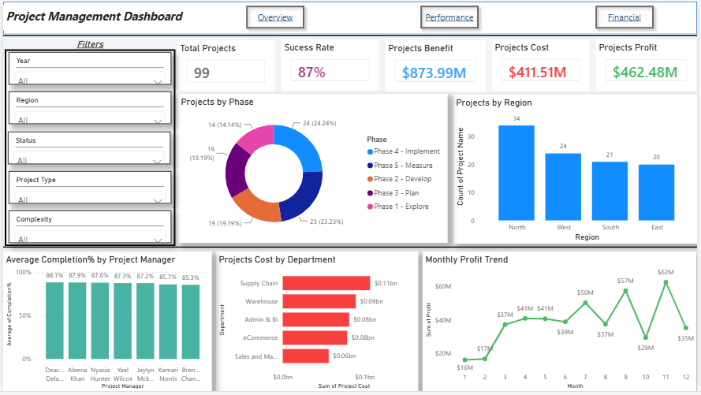
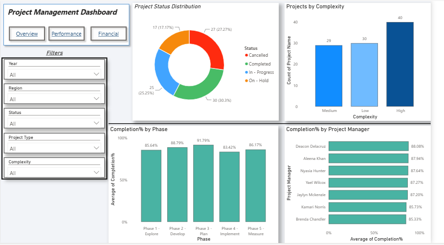
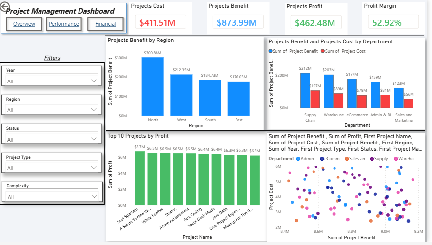

# PowerBI-project-management-dashboard
# Project Management Dashboard | Power BI

## Project Overview

This project presents an interactive **Project Management Dashboard** developed using **Microsoft Power BI**. The dashboard provides a clear view of project performance, financial outcomes, project status, and operational efficiency across different regions, departments, project managers, and project phases.

The dashboard enables stakeholders and decision-makers to monitor project success, evaluate profitability, track completion rates, and identify areas that require improvement.

---

## Business Objective

Organizations often manage multiple projects simultaneously across different departments and regions. Monitoring project performance, profitability, and completion rates can become challenging without a centralized reporting solution.

The objective of this dashboard is to:

* Monitor overall project performance.
* Track project costs, benefits, and profitability.
* Evaluate project success rates.
* Compare project performance across regions and departments.
* Identify top-performing project managers.
* Analyze project status and completion progress.

---

## Dataset

* **Source:** Kaggle
* **Dataset Type:** Project Management Dataset
* **Records:** 99 Projects
* **Data Includes:**

  * Project Information (Project Name, Project Description, Project Type)
  * Project Manager
  * Region
  * Department
  * Project Cost
  * Project Benefit
  * Complexity
  * Project Status
  * Completion%
  * Project Phase
  * Project Profit
  * Year
  * Month
  * Start Date
  * End Date
  
---

## Tools & Technologies

* Microsoft Power BI
* Power Query
* DAX
* Data Modeling
* Interactive Visualizations

---

## 📈 Dashboard Pages

### 1️⃣ Overview Dashboard

Provides a high-level summary of project performance through key business metrics.

#### Key KPIs:

* Total Projects
* Success Rate
* Project Benefits
* Project Costs
* Project Profit

#### Visualizations:

* Projects by Phase
* Projects by Region
* Average Completion Percentage by Project Manager
* Project Cost by Department
* Monthly Profit Trend

---

### 2️⃣ Performance Dashboard

Focuses on operational performance and project execution.

#### Visualizations:

* Project Status Distribution
* Projects by Complexity Level
* Completion Percentage by Project Phase
* Completion Percentage by Project Manager

#### Insights:

* Identify project execution bottlenecks.
* Compare performance across project phases.
* Evaluate project manager effectiveness.
* Monitor project status distribution.

---

### 3️⃣ Financial Dashboard

Analyzes project financial performance and profitability.

#### Key KPIs:

* Total Project Cost
* Total Project Benefit
* Total Project Profit
* Profit Margin

#### Visualizations:

* Project Benefits by Region
* Project Benefits vs Project Costs by Department
* Top 10 Projects by Profit
* Project Cost vs Project Benefit Analysis

#### Insights:

* Identify the most profitable projects.
* Compare departmental financial performance.
* Evaluate return on investment across regions.
* Monitor profit margin and financial efficiency.

---

## Key Findings

* The overall project success rate reached **87%**.
* Total project benefits exceeded **$873M**.
* Total project profit exceeded **$462M**.
* Regional performance varies significantly, highlighting opportunities for resource optimization.
* Some departments generate substantially higher financial returns than others.
* Project completion rates remain consistently above 80% across project phases.

---

## Dashboard Features

* Interactive Filters:

  * Year
  * Region
  * Status
  * Project Type
  * Complexity

* Cross-filtering between visuals.

* Dynamic KPI updates.

* Interactive business insights.

---

## Dashboard Screenshots

### Overview Page

### Performance Page

### Financial Page

---

## How to Use

1. Open the `Full Project management task .pbix` File in Power BI Desktop.
2. Explore dashboard pages.
3. Use slicers to filter data.
4. Analyze project performance and financial outcomes.

---

## Author

Jameela Smadi

Aspiring Data Analyst | Power BI | SQL | Python | Excel
